# Knack Infrastructure — Technical Document (v1)

## 1) Summary
- Production runs in AWS me-central-1 (UAE) on two EC2 instances:
  - App host (Docker, 17 containers): Nginx + certbot, API Gateway (Express Gateway), microservices, RabbitMQ
  - Database host (Docker): MongoDB 4.4.21 and Redis (email cache)
- Bahrain (me-south-1): Portainer EC2 only (admin)
- DNS: Cloudflare; TLS via certbot inside Nginx containers
- CI/CD: GitHub Actions → ECR (UAE) → pull on EC2 → redeploy via Portainer

## 2) Environments and regions
- me-central-1 (UAE): production (active)
- me-south-1 (Bahrain): Portainer EC2 (admin; no runtime services)
- Staging: EC2 and subdomains inactive

Spec deltas (staging vs prod)
- Staging EC2: terminated; staging subdomains present but considered inactive
- Staging Mongo: Atlas was used historically (no active staging DB on EC2 now)

## 2a) Specs

### Regions and VPCs

| Scope | Region | VPC ID | CIDR | Notes |
|---|---|---|---|---|
| Primary | me-central-1 (UAE) | vpc-0a550354ea5eac85c | 172.31.0.xxx/16 | Default VPC; public subnets; IGW present |
| Admin | me-south-1 (Bahrain) | vpc-0f2fdf66 | 172.31.0.xxx/16 | Default VPC; public subnets; IGW present |

### EC2 instances

| Role | Instance ID | Type | Private IP | Public IP | Subnet | VPC | IAM Profile |
|---|---|---:|---|---|---|---|---|
| App/Services | i-0d7c66808479e17dd | t3.medium | 172.31.24.xxx | 3.29.106.xxx | subnet-09aba3af4c6f16ffc | vpc-0a550354ea5eac85c | ec2-admin |
| Database (Mongo/Redis) | i-0f36876accfdff9c1 | t3.medium | 172.31.30.xxx | 3.28.24.xxx | subnet-09aba3af4c6f16ffc | vpc-0a550354ea5eac85c | — |
| Portainer (admin) | i-0ec90ed5af61f4cbd | t3.small | 172.31.24.xxx | 15.184.114.xxx | subnet-3c100244 | vpc-0f2fdf66 | — |

### EC2 volumes (database host)

| Volume ID | Device | Size | Type | Encrypted |
|---|---|---:|---|---|
| vol-063a862e95ebef93f | /dev/sdb | 64 GiB | gp3 | False |
| vol-0afb93dc21bc350f2 | /dev/xvda | 30 GiB | gp3 | False |

### Security groups (inbound summary)

| SG ID | Attached to | Ports | Source |
|---|---|---|---|
| sg-01b1f755a9defafce | App EC2 | 80/tcp, 443/tcp, 22/tcp | 0.0.0.xxx/0 |
| sg-01b1f755a9defafce | App EC2 | 9001/tcp | 15.184.114.xxx/32 |
| sg-0a67c32767ae61212 | DB EC2 | 22/tcp | 0.0.0.xxx/0 |
| sg-0a67c32767ae61212 | DB EC2 | 6379/tcp | 172.31.24.xxx/32 |
| sg-0a67c32767ae61212 | DB EC2 | 8099/tcp, 8905/tcp | 172.31.24.xxx/32 + fixed admin IPs |

### Containers and services (App EC2)

| Category | Name |
|---|---|
| Ingress | nginx-proxy (Nginx + certbot) |
| Ingress | api-gateway (Express Gateway) |
| Business | auth-ms; assessment-ms (v1); survey-ms; notification-ms; report-ms; program-ms; goal-ms |
| Sessions | session-logging-ms; session-scheduler-ms |
| Utilities | email-ms (v2); file-upload-ms; knack-frontend |
| Infra | rabbitmq; mongodb-change-streams (legacy) |

Ports map (service → port on container):
- nginx-proxy → 80/443
- api-gateway → 8099
- knack-frontend → 3001 (staging had 3002 for preview)
- rabbitmq → 15672 (management), 5672 (AMQP)
- email-ms → (HTTP port per container config)
- file-upload-ms → (HTTP port per container config)
- other services (auth-ms, assessment-ms, survey-ms, notification-ms, report-ms, program-ms, goal-ms, session-logging-ms, session-scheduler-ms) → HTTP ports as defined in each service Dockerfile/config (exposed via API Gateway)

### Data stores

| Store | Version/Type | Location | Notes |
|---|---|---|---|
| MongoDB | 4.4.21 (Docker) | DB EC2 | ~881 MB on disk; single node; data dir /data/db |
| Redis | Docker (cache-only) | DB EC2 | Non-persistent (email caching) |
| RabbitMQ | Docker | App EC2 | Queues: recurring_surveys, email_notification_v2, event_notification (idle at capture) |

### S3 buckets

| Bucket | Region | Versioning | Encryption | Lifecycle | Notes |
|---|---|---|---|---|---|
| knacklab-assets | me-south-1 | None | SSE-S3 | None | Static/assets |
| knacklab-programs | me-south-1 | None | SSE-S3 | None | Program content |
| mongo-backup-knack | me-central-1 | None | SSE-S3 | None | Latest object 2023‑06‑11 |

### DNS and TLS

| FQDN | Target | Served by |
|---|---|---|
| app.knacklab.co | 3.29.106.xxx | Nginx → frontend |
| api-gateway.knacklab.co | 3.29.106.xxx | Nginx → Express Gateway |
| portainer.knacklab.co | 15.184.114.xxx | Portainer EC2 |

TLS: Let’s Encrypt via certbot in Nginx container (renew + reload).

### CI/CD and ECR

| Stage | Tool | Detail |
|---|---|---|
| Build | GitHub Actions | Docker build/test |
| Publish | Amazon ECR (me-central-1) | Service images |
| Deploy | App EC2 + Portainer | Pull latest; redeploy containers |

Key ECR repos:
- backend/api-gateway
- backend/auth-ms-v2
- backend/email-ms-v2
- backend/assessment-ms-v2
- backend/survey-ms-v2
- backend/report-ms
- backend/program-ms-v2
- backend/notification-ms
- backend/session-logging-ms
- backend/session-scheduler-ms
- backend/file-upload-ms
- backend/nginx-proxy
- frontend/knack-frontend
- backend/assessment-ms
- backend/cron-service-ms
- backend/goal-ms
- mongodb-change-streams

## 3) Topology

## 4) CI/CD (vertical)

## 5) Domains and DNS
- Provider: Cloudflare zone `knacklab.co`
- Production:
  - `app.knacklab.co` → 3.29.106.xxx (Nginx on app EC2)
  - `api-gateway.knacklab.co` → 3.29.106.xxx (Nginx → Express Gateway)
- Admin:
  - `portainer.knacklab.co` → 15.184.114.xxx (Portainer EC2)
- TLS: certbot inside the Nginx container (per-domain certs; auto-renew + nginx reload)

## 6) Network layout
- VPC (UAE): default VPC 172.31.0.xxx/16; public subnets; Internet Gateway (IGW)
- Routing: public subnets route 0.0.0.xxx/0 → IGW
- Security groups (snapshot for review; no changes made by this doc):
  - Services EC2: allows HTTP/HTTPS; admin ports; rules from Portainer IPs
  - Mongo EC2: allows app-to-db; Redis (6379) from app EC2 private IP

## 7) Compute inventory
- App EC2 (knack-prod)
  - Instance: t3.medium, i-0d7c66808479e17dd, priv 172.31.24.xxx, pub 3.29.106.xxx
  - Role/profile: ec2-admin
- Database EC2 (Mongo host)
  - Instance: t3.medium, i-0f36876accfdff9c1, priv 172.31.30.xxx, pub 3.28.24.xxx
  - EBS: 64 GiB (data, gp3), 30 GiB (root, gp3)

## 8) Containerized services (prod EC2)
- Ingress
  - `nginx-proxy`: TLS termination with certbot; serves app and API domains
  - `api-gateway`: Express Gateway routing /v1, /v2 to services
- Business services
  - `auth-ms` (authentication-onboarding-ms)
  - `assessment-ms` (v1)
  - `survey-ms`
  - `notification-ms`
  - `report-ms`
  - `program-ms`
  - `goal-ms`
  - `session-logging-ms`
  - `session-scheduler-ms`
  - `email-ms` (v2)
  - `file-upload-ms`
  - `knack-frontend` (React)
- Infra components
  - `rabbitmq` (queues observed: recurring_surveys, email_notification_v2, event_notification)
  - `mongodb-change-streams` (legacy feeder)

## 9) Data layer
- MongoDB
  - Version: 4.4.21 (Docker)
  - Size observed: ~881 MB
  - Volumes: gp3 64 GiB (data), 30 GiB (root), currently unencrypted
- Redis (Docker)
  - Purpose: email caching (non‑persistent)
- RabbitMQ (Docker)
  - Queues: recurring_surveys, email_notification_v2, event_notification (0 messages at capture)

## 10) Storage and artifacts
- S3 buckets
  - `knacklab-assets` (user assets/static)
  - `knacklab-programs` (content/program files)
  - `mongo-backup-knack` (historical dumps)
- ECR
  - me-central-1: primary image repositories for backend/frontend
  - me-south-1: regional ECR (admin/mirror)

## 11) Observability
- Uptime monitoring (HTTPS)
- Logs: container stdout (no CloudWatch Logs currently)

## 12) CI/CD summary
- Build: GitHub Actions
- Artifacts: Docker images → Amazon ECR (me-central-1)
- Deploy: EC2 pulls latest images; Portainer redeploys containers

## 13) Backups and DR
- Mongo
  - S3 dumps exist historically (`mongo-backup-knack`)
  - Recent EBS snapshots: none surfaced in query
- S3 hygiene (to plan): enable versioning + lifecycle for `assets`, `programs`, `mongo-backup-knack`

## 14) Security posture
- IAM: users + roles; identity provider present
- EC2 access: managed via security groups; Portainer used for container orchestration
